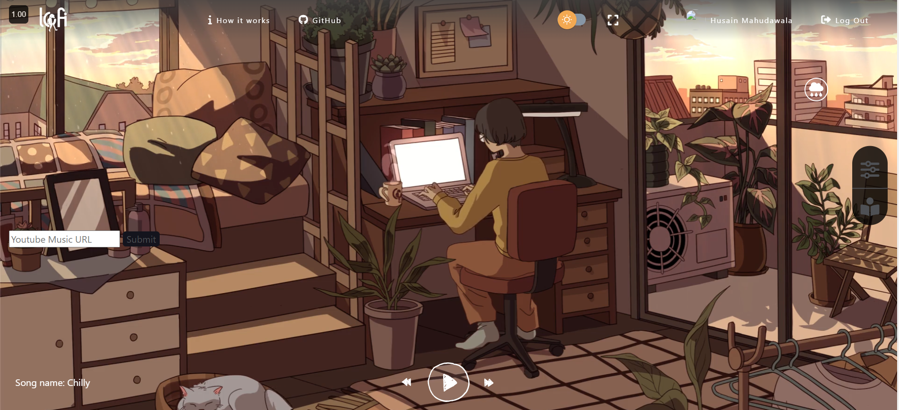
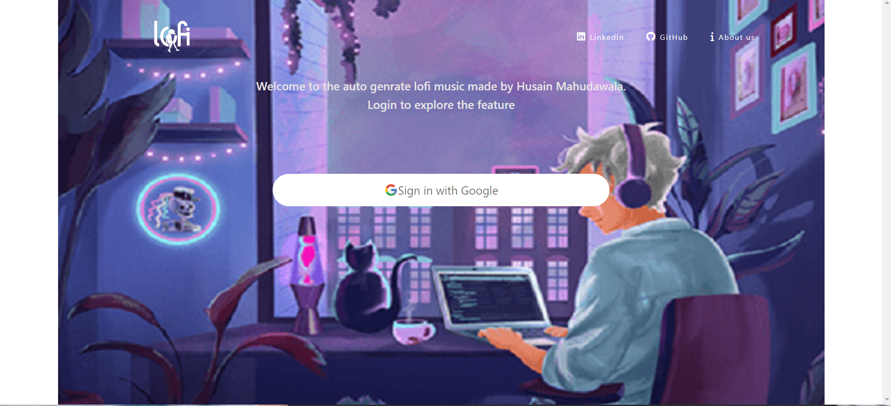
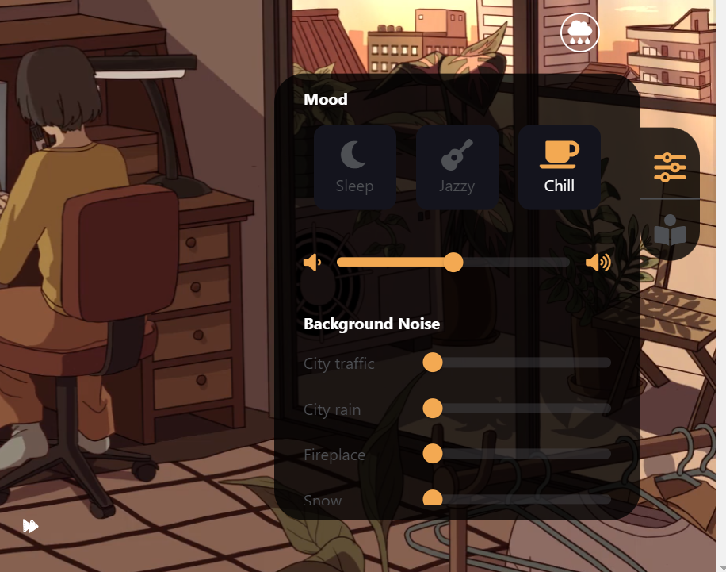

# 🎵 LoFi Music Web App 🎵

[](https://reactjs.org/)
[](https://redux.js.org/)
[](https://mui.com/)
[](LICENSE)

Welcome to the LoFi Music Web App! This project is a web application that allows users to generate and listen to LoFi music with various ambient sounds and moods. Dive into a world of calm and relaxation with our customizable soundscapes.


## 🌟 Features

- **🌞 Day/Night Mode**: Switch between day and night modes.
- **🌧 Rain Toggle**: Toggle rain sounds on and off.
- **🎵 Mood Selection**: Choose different moods for music (e.g., Sleep, Jazzy, Chill).
- **🎚 Ambient Sounds**: Control volume for various ambient sounds like city traffic, rain, fireplace, etc.
- **⏳ Focus Mode**: Set a countdown timer and manage tasks.
- **📱 Responsive Design**: Adaptable UI for different screen sizes.

## 🚀 Quick Start

### Installation

1. **Clone the repository**:

   ```bash
   git clone https://github.com/Byteers/Lofi-Env-Study.git
   cd lofi-Env-Study
   ```

2. **Install dependencies**:

   ```bash
   npm install
   ```

3. **Start the development server**:

   ```bash
   npm start
   ```

4. **Open your browser** and go to `http://localhost:3000`.

### Project Structure

```
lofi-music-web-app/
├── public/
│   ├── assets/
│   │   ├── icons/
│   │   ├── musics/
│   │   ├── video/
│   │   └── ...
│   └── ...
├── src/
│   ├── components/
│   │   ├── CountDownTimer/
│   │   ├── Footer/
│   │   ├── Home/
│   │   ├── Login/
│   │   ├── ModifierBoard/
│   │   ├── RainToggleButton/
│   │   ├── TodoList/
│   │   ├── YoutubeVideo/
│   │   └── ...
│   ├── redux/
│   │   ├── actions/
│   │   ├── reducers/
│   │   └── store.js
│   ├── App.js
│   ├── index.js
│   └── ...
├── .gitignore
├── package.json
├── README.md
└── ...
```

## 📸 Screenshots

### Home Page



### Login Page



### Modifier Board



## 🛠 Technologies Used

- **React**: A JavaScript library for building user interfaces.
- **Redux**: A state management library for JavaScript apps.
- **Material-UI**: React components for faster and easier web development.
- **React-Router**: Declarative routing for React.
- **SCSS**: A CSS preprocessor for more maintainable and modular styles.

## 🎯 Usage

- **Login**: Navigate to the login page and sign in with Google.
- **Home**: After logging in, you will be redirected to the home page where you can toggle rain, change the day/night mode, set timers, manage tasks, and select different moods and ambient sounds.

## 🤝 Contributing

1. **Fork the repository**.
2. **Create a new branch** (`git checkout -b feature-branch`).
3. **Commit your changes** (`git commit -am 'Add new feature'`).
4. **Push to the branch** (`git push origin feature-branch`).
5. **Create a new Pull Request**.

## 🌐 Live Demo

Check out the live version of the app [here](s(https://lofi-env-study.vercel.app/)).

## 📄 License

This project is licensed under the MIT License. See the [LICENSE](LICENSE) file for details.

## 📞 Contact

For any inquiries or feedback, please contact Husain Mahudawala at [husain.m.offc@gmail.com].

---

### Made with ❤️ by Husain Mahudawala


